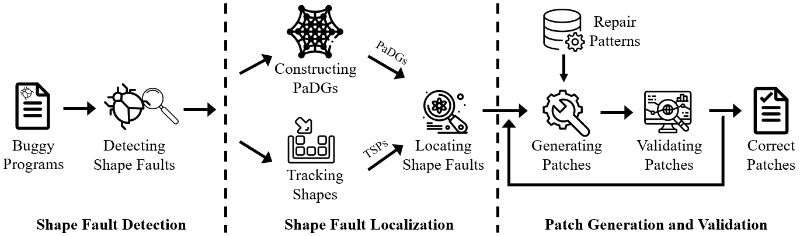

# Tensfa
An approach to detecting and repairing crashing tensor shape faults.

## Introduction

Software developers frequently invoke deep learning (DL) APIs to incorporate learning solutions into software systems. However, misuses of these APIs can cause various DL faults, such as tensor shape faults. Tensor shape faults occur when restriction conditions of operations are not met; they are prevalent in practice, leading to many system crashes.

Meanwhile, researchers and engineers still face a strong challenge in detecting tensor shape faults --- static techniques incur heavy overheads in defining detection rules, and the only dynamic technique requires human engineers to rewrite APIs for tracking shape changes. 

To address the above challenge, we conduct a deep empirical study on crashing tensor shape faults (i.e., those causing programs to crash), categorizing them into four types and revealing twelve repair patterns.

We then propose and implement Tensfa, an approach to detecting and repairing crashing tensor shape faults. 

The following figure presents an overview of Tensfa.
* Tensfa takes a machine learning method to learn from crash messages and employs decision trees in detecting tensor shape faults. Detection code is available [here](./detect).
* Tensfa also provides the first automated solution to repairing the detected faults: it tracks shape properties by a customized Python debugger, analyzes their data dependences, and uses the twelve patterns to generate patches. Localization and repair code is available [here](./locate_repair).

## Dataset

We construct SFData, a set of 146 buggy programs with crashing tensor shape faults. Our Tensfa has been implemented and evaluated on SFData and IslamData (another dataset of tensor shape faults). The results clearly show the effectiveness of Tensfa. In particular, Tensfa achieves the state-of-the-art results: it reaches an F1-score of 96.88% in detecting the faults and repairs 80 out of 146 buggy programs in SFData, which is available [here](./SFData).