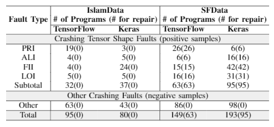

# SFData
SFData consists of 146 buggy programs with crashing tensor shape faults. Among them, 59 are TensorFlow programs and 87 are Keras ones. Each record has the attributes:
[ProgramID, crash message, {fault type}, postID (question id) in StackOverflow, original code, patch, {test data}]; for each tensor shape fault, its program, tests and patch are provided such that the fault can be reproduced.

## Structure of the Directories
 ```
  |--- README.md                          :  User guidance
  |--- data                               :  Data used by the programs
  |--- ICSE2020                           :  Programs, patchs and test cases where only the question ids are from the ICSE2020 paper
  |--- StackOverflow                      :  Programs, patchs and test cases that are collected by searching StackOverflow
  |--- ISSTA2018                          :  Programs, patchs and test cases from the ISSTA2018 papar
  |--- ICSE2020TensorflowAndKeras.xlsx    :  Metadata where only the question ids are from the ICSE2020 paper
  |--- ICSE2020ToDetect.xlsx              :  Metadata where only the question ids are from the ICSE2020 paper
  |--- ICSE2020ToRepair.xlsx              :  Metadata where only the question ids are from the ICSE2020 paper
  |--- KerasException.xlsx                :  Metadata that are collected by searching StackOverflow
  |--- StackOverflow.xlsx                 :  Metadata that are collected by searching StackOverflow
  |--- ISSTA2018NoTensorShapeFault.xlsx   :  Metadata from the ISSTA2018 papar
```

## Program
 ```
  |--- s[question_id]_original.py         :  Original program in the post #question_id on StackOverflow
  |--- s[question_id]_context.py          :  Program supplemented contexts
  |--- s[question_id]_ground_truth.py     :  Program manually repaired
```

## Statistics
<div align=center></div>