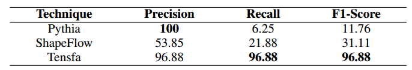

# Detection of Tensor Shape Faults
We have observed that when a program crashes, it usually generates a crash message. In the study, we adopt a traditional ML-based technique, which casts the detection of the tensor shape faults into a binary classification problem. One main reason is that there does not exist a large training dataset of tensor shape faults, and thus an ML model, rather than a DL one, should be chosen for training. The decision tree is also an appropriate model to solve this problem because of its favorable learning ability and interpretability.

## Environment
* python 3.6.5
* sklearn 0.24.1
* spacy 3.0.5
* pandas 1.0.1
* tqdm 4.43.0

## Use

1. `cd` to this directory.

2. 
   - To train the model, run:

   ```
    python train.py
   ```

   - To test the model, run:

   ```
    python test.py
   ```

## Results
<div align=center></div>