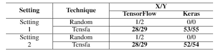

# Localization and Repair of Tensor Shape Faults
For each detected fault, Tensfa locates its root cause by analyzing PaDGs of the OP’s parameters (input tensors and/or right values) and tracking the tensors’ shapes, and identifies the violated shape restriction(s). Tensfa then applies repair patterns to modify the suspicious faulty variables, generating and validating patch candidates.

## Environment
* python 3.6.5
* tensorflow 1.15.0
* tqdm 4.43.0

## Use
1. `cd` to this directory.

2. 
   - To repair the tensor shape faults in the directory `../SFData/StackOverflow`, run:

   ```
    python fix_shapes.py StackOverflow
   ```

   - To repair the tensor shape faults in the directory `../SFData/ICSE2020ToRepair`, run:

   ```
    python fix_shapes.py ICSE2020ToRepair
   ```

## Results
<div align=center></div>